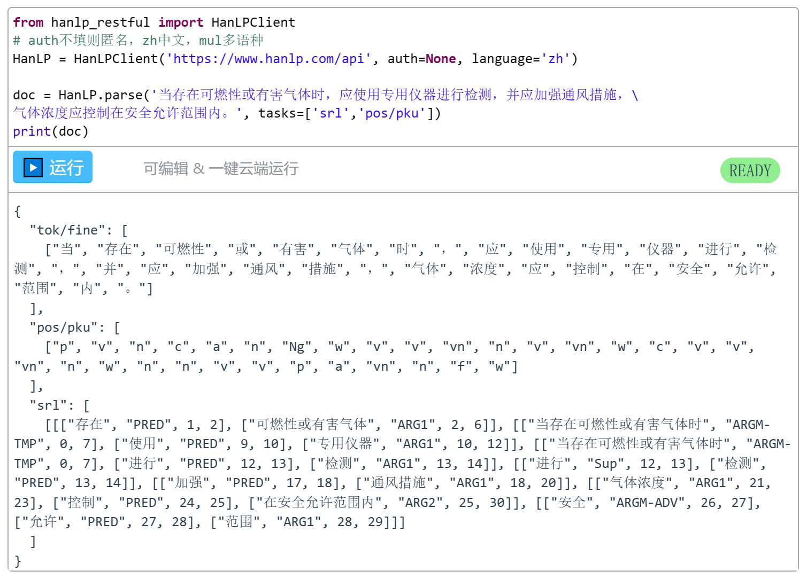

# Project
**基于SRL的施工规范知识抽取**

--*Author: Liu Jiangbo*
--*Date: 2023.5.21*

Description: 利用现有NLP平台（HanLP）预训练模型提供的SRL分析结果，通过基于规则的后优化处理和模式匹配，实现规范条文知识的自动抽取及结构化整理。

**语义角色标注**（**Semantic Rule Labeling, SRL**）是一种浅层**语义分析技术**，标注句子中某些短语为给定谓词的论元（**语义角色**），如施事者、受事者、经验者、时间和地点等，能够对问答系统、信息抽取和机器翻译等应用产生推动作用。

|   **类型**   | **语义角色标签** | **角色说明** |
| :----------: | :--------------: | :----------: |
|     谓词     |       PRED       |   中心谓词   |
| 核心语义角色 |     ARG0(A0)     |    施事者    |
|              |       ARG1       |    受事者    |
|              |    ARG2-ARG5     |  依谓词而定  |
| 附属语义角色 |     ARGM-ADV     |     状语     |
|              |     ARGM-TMP     |     时间     |
|              |     ARGM-LOC     |  地点、位置  |
|              |     ARGM-MNR     |     方式     |
|              |     ARGM-DIR     |     方向     |

- [Project](#project)
  - [抽取流程](#抽取流程)
    - [STEP1: 文本获取与预处理](#step1-文本获取与预处理)
    - [STEP2: 条文分类](#step2-条文分类)
    - [STEP3: NLP-SRL处理](#step3-nlp-srl处理)
    - [STEP4: 知识模式匹配](#step4-知识模式匹配)
  - [环境](#环境)
  - [使用](#使用)
  - [目录结构](#目录结构)


## 抽取流程

<center>基于SRL的知识抽取流程</center>

### STEP1: 文本获取与预处理
*（正则）*
1. 文本清洗
2. 条文识别
3. 条文过滤

### STEP2: 条文分类
1. 基于正则表达式的条文分类规则
2. 根据优先顺序，迭代判断条文类型

| **序号** | **条文类型** | **正则表达式**                 |
| **1** | **术语类** |	.*[^0-9][^A-Z][a-z]{4,} .*[\u4e00-\u9fa5]+.
| **2** | **参考类** |	.+《.+
| **3** | **属性类** |	.+[0-9][A-Za-z|°|″|'|％|‰|℃].*
| **4** | **根据类** |	.*根据.+
| **5** | **工序类** |	.+前，.+|.+后，.+|.+期间[^；|。].+
| **6** | **情境类** |	.*(当.+时，.+)|(.+时，.+应.+)
| **7** | **要求类** |	^[^(必须|严禁|应|不应|不得|宜|不宜|可)].+(必须|严禁|应|不应|不得|宜|不宜|可).+

### STEP3: NLP-SRL处理
*针对单个句子进行NLP-SRL处理，旨在找到最优SRL处理结果*

1. NLP处理
    一个句子的SRL结果可能具有多个**谓词论元结构**(Predicate - Argument, PA)，每个PA结构由多个四元组形式的SRL元素构成：(**entity, type, begin, end**)，即(**谓词或论元，SRL标签，词语在分词列表的起始索引，结束索引**)。



2. SRL后优化处理
    (1). 词语包含处理
    (2). 区间合并处理
    (3). 无效SRL组(PA结构)剔除处理


**例句：**
"当存在可燃性或有害气体时，应使用专用仪器进行检测，并应加强通风措施，气体浓度应控制在安全允许范围内。"  
注：例句源自《盾构法隧道施工及验收规范 GB50446-2017》。


**优化结果的可视化实现：**
```
from hanlp_common.document import Document
sentence_nlp = {"tok": tok, "pos": pos, "srl": srl}
doc = Document(sentence_nlp)
doc.pretty_print()
```

### STEP4: 知识模式匹配
*针对单个SRL组（PA结构）进行匹配处理，将语义角色对应的词语与知识结构中的语义概念进行对齐*

1. 识别主宾，标签替换
   (基于核心语义角色ARG0-ARG5的出现顺序就行主宾识别，将主语、宾语对应的SRL标签分别统一为ARG0、ARG1)

2. 重复SRL标签重构
   (例如：将一组SRL标签[PRED，ARG1，PRED，ARG1]重构为[PRED，ARG1，PRED_1，ARG1_1]，以便于数据分析与处理)

3. 知识映射

*(**基本模式**)*
```
{"ARGM-TMP": "情境描述",
"ARG0": "主体",
"ARGM-ADV": "否定描述",
"PRED": "动作Action",
"ARG1": "对象",
"ARGM-LOC": "位置",
"ARGM-MNR": "方式",
"PRED-1": "动作Action1",
"ARG1-1": "对象1"}

# 形如"PRED-ARG1-PRED-ARG1"的知识元组，重构标签为"PRED-ARG1-PRED_1-ARG1_1"，构成施工活动链。
```

*(**自定义模式**)*
| 条文类型 |         SRL标签         | 语义概念 |
| :------: | :---------------------: | :------: |
|  参考类  |          ARG1           | 参考规范 |
|  属性类  | ARGM-ADV（&包含否定词） | 否定描述 |
|          |          PRED           | 比较描述 |
|          |          ARG1           | 数量描述 |
|  工序类  |        ARGM-TMP         | 顺序描述 |

## 环境
1. python 3.7  
2. hanlp 2.1.0b45  # pip install hanlp -i https://pypi.douban.com/simple/
3. pandas
4. matplotlib
5. numpy
6. tqdm

## 使用
1.配置HanLP模型 (前提)

    # 原始模型可由如下方式导入：
    > HanLP = hanlp.load(hanlp.pretrained.mtl.CLOSE_TOK_POS_NER_SRL_DEP_SDP_CON_ERNIE_GRAM_ZH)
    # or
    > HanLP = hanlp.load(hanlp.pretrained.mtl.CLOSE_TOK_POS_NER_SRL_DEP_SDP_CON_ELECTRA_BASE_ZH)

    # 自定义模型在导入原始模型的基础上，通过config文件夹中的hanlp_conf.py文件配置，主要基于model_configuration函数。

    # 默认多任务联合模型（上述模型可选）、细粒度分词（tok/fine）进行处理，并导入自定义领域词典。
    
2.文本处理     data_preprocess.py
    *(原始规范文本 -> 预处理后的规范文本)*

3.知识抽取     pipeline.py
    *(预处理后的规范文本 -> 知识抽取结果)*
    注：支持导出json、csv、excel格式的抽取结果

## 目录结构

```
Project  -- 项目目录
├─ config  --  函数包
│  ├─ hanlp_conf.py  --  配置hanlp模型
│  ├─ help_functions_new.py  --  知识抽取辅助函数
│  ├─ process_new.py  --  SRL后优化功能函数
├─ config.json  --  配置文件
├─ config.py  --  生成配置文件
├─ dict.txt  --  领域词典文件
├─ hanlp_model_conf_new.py  --  hanlp-SRL后优化处理程序
├─ hanlp_optimize_progress_debug.py  --   hanlp-SRL后优化处理debug程序
├─ hanlp_test.py  --  hanlp学习
├─ pipeline.py  --  知识抽取程序
├─ data  --  数据文件夹
│  ├─ data_preprocess.py  --  文本预处理程序
│  ├─ test.txt
└─ result  --  结果文件夹

```