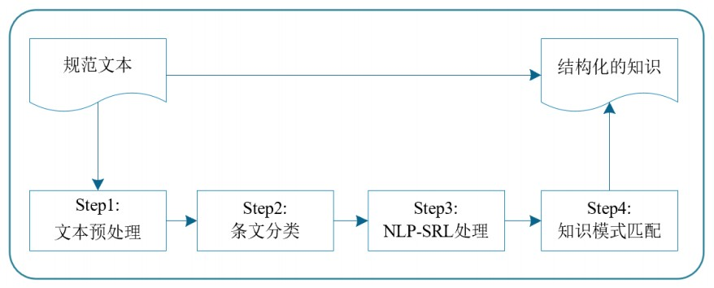
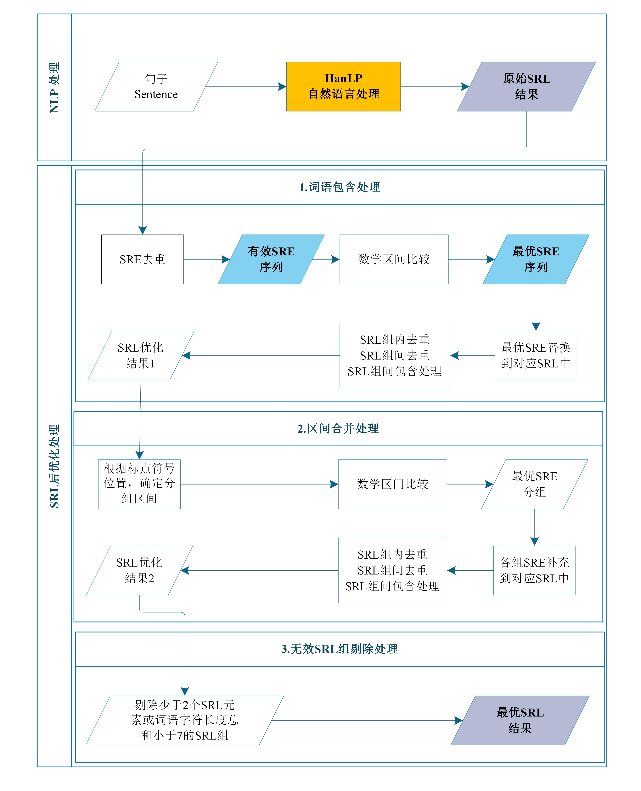
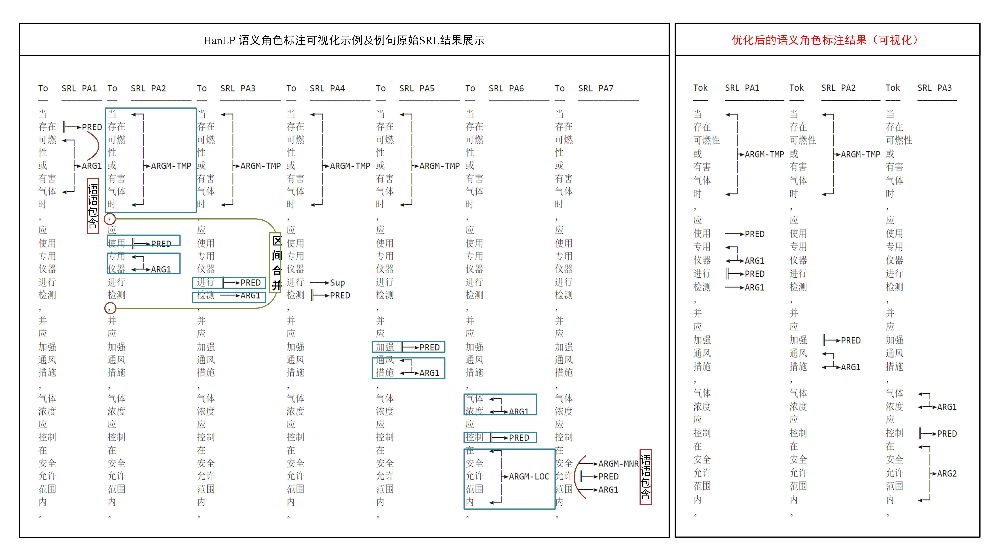

# Project
**基于SRL的施工规范知识抽取**

--*Author: Liu Jiangbo*  
--*Date: 2023.5.21*

  > Description: 利用现有NLP平台（HanLP）预训练模型提供的SRL（Semantic Rule Labeling, 语义角色标注）分析结果，通过基于规则的后优化处理和模式匹配，实现规范条文知识的自动抽取及结构化整理。

- [Project](#project)
  - [抽取流程](#抽取流程)
    - [STEP1: 文本获取与预处理](#step1-文本获取与预处理)
    - [STEP2: 条文分类](#step2-条文分类)
    - [STEP3: NLP-SRL处理](#step3-nlp-srl处理)
    - [STEP4: 知识模式匹配](#step4-知识模式匹配)
  - [环境](#环境)
  - [使用](#使用)
  - [目录结构](#目录结构)


## 抽取流程


### STEP1: 文本获取与预处理
*（正则）*
1. 文本清洗
2. 条文识别
3. 条文过滤

### STEP2: 条文分类
1. 基于正则表达式的条文分类规则
2. 根据优先顺序，迭代判断条文类型

### STEP3: NLP-SRL处理
1. NLP处理
    >一个句子的SRL结果可能具有多个谓词论元结构(Predicate - Argument, PA)，每个结构由多个四元组形式的 SRL元素构成：(entity, type, begin, end)，即(谓词或论元，SRL标签，词语在分词列表的起始索引，结束索引)。

2. SRL后优化处理
    (1). 词语包含处理
    (2). 区间合并处理
    (3). 无效SRL组剔除处理



例子：
> "当存在可燃性或有害气体时，应使用专用仪器进行检测，并应加强通风措施，气体浓度应控制在安全允许范围内。" 
> 
>例句源自国家标准:《盾构法隧道施工及验收规范 GB50446-2017》



### STEP4: 知识模式匹配
*针对单个SRL组进行匹配处理，将语义角色对应的词语转与语义概念进行对齐*
1. 基于SRL语义角色的主宾分析，标签重构
2. 知识映射

## 环境
1. python 3.7
2. hanlp 2.1.0b45
3. pandas
4. collections
5. matplotlib
6. numpy
7. tqdm

## 使用
1.前提：配置HanLP模型

    原始模型可由如下方式导入：
    > HanLP = hanlp.load(hanlp.pretrained.mtl.CLOSE_TOK_POS_NER_SRL_DEP_SDP_CON_ERNIE_GRAM_ZH)
              or
    > HanLP = hanlp.load(hanlp.pretrained.mtl.CLOSE_TOK_POS_NER_SRL_DEP_SDP_CON_ELECTRA_BASE_ZH)

    自定义模型在导入原始模型的基础上，通过config文件夹中的hanlp_conf.py文件配置，主要基于model_configuration函数。

    默认多任务联合模型（上述模型可选）、细粒度分词（tok/fine）进行处理，并导入自定义领域词典。
    
2.文本处理     data_preprocess.py
    (*原始规范文本 -> 预处理后的规范文本*)

3.知识抽取     pipeline.py
    (*支持导出json、csv、excel格式的抽取结果*)

## 目录结构

```
Project  -- 项目目录
├─ config  --  函数包
│  ├─ hanlp_conf.py  --  配置hanlp模型
│  ├─ help_functions_new.py  --  知识抽取辅助函数
│  ├─ process_new.py  --  SRL后优化功能函数
├─ config.json  --  配置文件
├─ config.py  --  生成配置文件
├─ dict.txt  --  领域词典文件
├─ hanlp_model_conf_new.py  --  hanlp-SRL后优化处理程序
├─ hanlp_optimize_progress_debug.py  --   hanlp-SRL后优化处理debug程序
├─ hanlp_test.py  --  hanlp学习
├─ pipeline.py  --  知识抽取程序
├─ data  --  数据文件夹
│  ├─ data_preprocess.py  --  文本预处理程序
│  ├─ test.txt
└─ result  --  结果文件夹

```